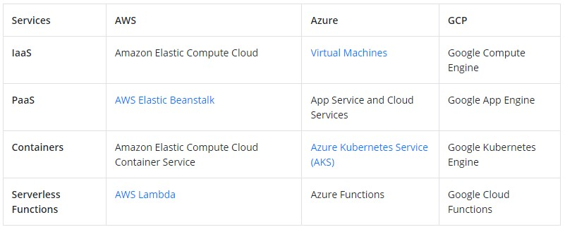
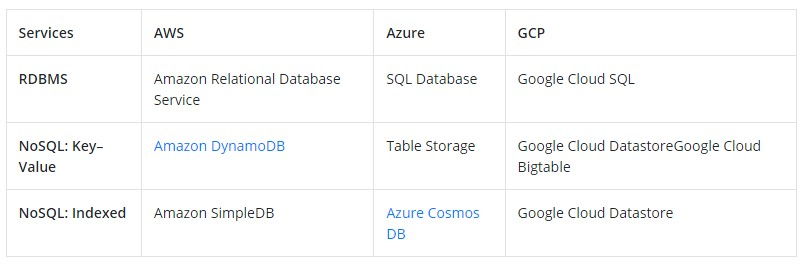
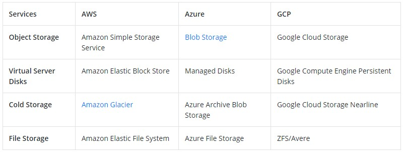
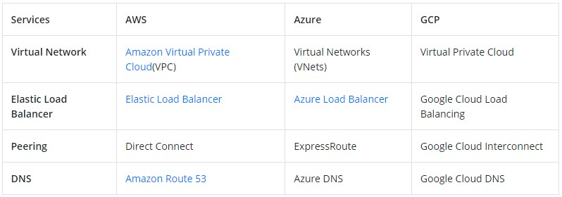
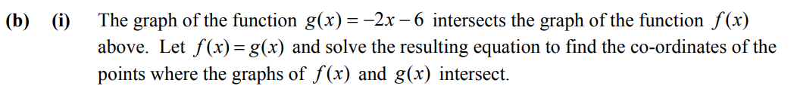

# AWS Solution Architect Associate Material

## Introduction

Amazon Web Services (AWS) is the world’s most comprehensive and broadly adopted cloud, offering over 200 fully featured services from data centers globally. Millions of customers—including the fastest-growing startups, largest enterprises, and leading government agencies—are using AWS to lower costs, become more agile, and innovate faster.

## Courses to follow for AWS SAA-C03 Certificate:

To PASS AWS Solution Architect Associate certification, you just need to follow below course by Stephane Maarek and then, start giving practice tests.
Don't worry if you get any low score like 30% or 40% or 50% even though you complete the course two times. Attempt them until you start getting 80% plus. **Thats the key to PASS certification.**
I did complete the course and then took each practice test atleast 2 times until unless I got 80% plus.

- Follow Stephane Maarek **Ultimate AWS Certified Solutions Architect Associate SAA-C03** link below:
  <https://www.udemy.com/course/aws-certified-solutions-architect-associate-saa-c03/>

- Follow Stephane Maarek **Practice Exams | AWS Certified Solutions Architect Associate** link below:
  <https://www.udemy.com/course/practice-exams-aws-certified-solutions-architect-associate/>

- Follow Neal Davis **AWS Certified Solutions Architect Associate Practice Exams** link below:
  <https://www.udemy.com/course/aws-certified-solutions-architect-associate-practice-tests-k/>

## AWS vs Azure vs GCP?

AWS provides over 200 services, whilst Azure provides up to 100 services. Google Cloud, on the other hand, is catching up to Azure and AWS in terms of service offerings, offering roughly 60+ services.

### Compute Wise



### Database Wise



### Storage Wise



### Networking Wise



## Important Differences

### Interface Endpoint vs Gateway Endpoint


### CloudFront vs Global Accelerator


### Public IP vs Elastic IP



### Dedicated Host vs Dedicated Instance


### NAT Gateway vs NAT Instance


### Cognito User Pool vs Cognito Identity Pool


### AWS S3 vs Amazon EBS vs Amazon EFS


### Cloudwatch vs CloudTrail


### Security Group vs Network Access Control Lists (NACLs)


### System Parameter Store vs AWS Secrets Manager


### ALB vs NLB vs GLB


## **Exam Questions**

### **Question 1**

**An application runs on port 80 on Amazon EC2 instances behind an Application Load Balancer (ALB).
According to best practice, inbound traffic to the EC2 instances should be limited to receiving
traffic from the ALB. How should the EC2 instance security group be configured?**

```py
A) Allow inbound traffic to port 80 from the ALB nodes’ public IPs
B) Allow inbound traffic to port 80 from the VPC CIDR Block
C) Allow inbound traffic to port 80 from the NACL
D) Allow inbound traffic to port 80 from the ALB Security Group
```

#### Answer

==Correct Answer:==

==D) Allow inbound traffic to port 80 from the ALB Security Group==

==Answer explanation:== The best practice for security group configuration is to allow inbound traffic on the relevant port from the ALB Security Group. This will only allow connections on port 80 that originate from the ALB.

### Question 2

**A solutions architect is designing an application that requires a storage solution for session state data. The solution must be highly scalable and perform well with thousands of simultaneous users. Which service is MOST performant?**

```py
A) Amazon RDS
B) Amazon EFS
C) Amazon S3
D) Amazon ElastiCache
```

#### Answer

==Correct Answer:==

==D) Amazon ElastiCache==

==Answer explanation:== Amazon ElastiCache is a scalable, in-memory database that supports key-value data. It is suitable for storing session state data.

### Question 3

**A company runs a reporting application at the same time at the end of each week. The application gathers and collates information from many sources and causes a huge spike in CPU usage. The application runs on Amazon EC2 instances in an Auto Scaling group. When the report starts to run, users notice a drop in performance lasting several minutes. How can a solutions architect ensure the application does not slow down each week?**

```py
A) Configure an EC2 Auto Scaling scheduled scaling policy based on the monthly schedule
B) Configure an EC2 Auto Scaling simple scaling policy based on CPU Utilization
C) Configure Amazon ElastiCache to remove some of the workload from the EC2 instances
D) Configure an Amazon CloudFront distribution in front of an ALB
```

#### Answer

==Correct Answer:==

==A) Configure an EC2 Auto Scaling scheduled scaling policy based on the monthly schedule==

==Answer explanation:== Scheduled scaling allows you to set your own scaling schedule. In this case, the scaling action can be scheduled to occur just prior to the time that the reports will be run each month. Scaling actions are performed automatically as a function of time and date. This will ensure that there are enough EC2 instances to serve the demand and prevent the application from slowing down

### Question 4

**Some video files have been shared from Amazon S3 and Amazon CloudFront with a select group of customers using signed URLs. To further improve security, a solutions architect must ensure that it is not possible to directly access the objects in Amazon S3. What is the EASIEST way to achieve this requirement?**

```py
A) Create an origin access identity (OAI) and instruct users to login with the OAI and access the files
B) Create a Security group, restrict all inbound access, then creates a lower-numbered rule allowing CloudFront
C) Create an origin access identity (OAI) and restrict access to the files in the Amazon S3 bucket to the OAI
D) Create a bucket policy that restricts access to the bucket and only allows the CloudFront IP addresses
```

#### Answer

==Correct Answer:==

==C) Create an origin access identity (OAI) and restrict access to the files in the Amazon S3 bucket to the OAI==

==Answer explanation:== The solutions architect should create a special CloudFront user called an origin access identity (OAI) and associate it with the distribution. Then, modify S3 bucket permissions so that CloudFront can use the OAI to access the files in your bucket and serve them to users. The permissions should also ensure that users can’t use a direct URL to the S3 bucket to access a file there.

### Question 5

**An application running on Microsoft servers in an on-premises data center is attached to an SMB file share. The servers will be migrated to AWS and run across multiple Availability Zones. Which storage solution will be the most resilient replacement to the SMB share?**

```py
A) An Amazon FSx for Windows File Server filesystem
B) An Amazon EFS filesystem
C) An AWS DataSync datastore
D) An Amazon EBS volume
```

#### Answer

==Correct Answer:==

==A) An Amazon FSx for Windows File Server filesystem==

Answer explanation: Amazon FSx for Windows File Server provides fully managed, highly reliable file storage that is accessible over the industry-standard Server Message Block (SMB) protocol. It offers single-AZ and multi-AZ deployment options, fully managed backups, and encryption of data at rest and in transit.

### Question 6

**An on-premises web application is being refactored on AWS. The database layer currently uses an in-memory cache. The AWS solution should be highly available and support data replicas. Which service should be used for the database cache?**

```py
A) AWS CloudTrail
B) Amazon CloudFront
C) Amazon ElastiCache Redis
D) Amazon ElastiCache MemCached
```

#### Answer

==Correct Answer:==

==C) Amazon ElastiCache Redis==

Answer explanation: Amazon ElastiCache Redis is an in-memory database cache and supports high availability through replicas and multi-AZ.

### Question 7

**A MongoDB database is being deployed on an Amazon EC2 instance and requires sustained disk performance of over 16,000 IOPS. The database is expected to grow up to 1TB in size. Which Elastic Block Store (EBS) volume type is BEST suited to these requirements?**

```py
A) Cold HDD (sc1)
B) General Purpose SSD (gp2)
C) Throughput Optimized HDD (st1)
D) Provisioned IOPS SSD (io1)
```

#### Answer

==Correct Answer:==

==D) Provisioned IOPS SSD (io1)==

Answer explanation: The io1 volume type is suitable for critical business applications that require sustained IOPS performance, or more than 16,000 IOPS or 250 MB/s of throughput per volume. Volume sizes can be up to 16 TB (this maximum applies to all EBS volume types).

### Question 8

**An application is delivered over Layer 7 to internet-based users. The application runs on Amazon EC2 instances in a single Availability Zone. How can a Solutions Architect make the architecture highly available and cost-effective?
Select all that apply:**

```py
A) Configure an Auto Scaling group to add or remove instances in the Availability Zone automatically.
B) Configure an Application Load Balancer in front of the EC2 instances
C) Configure an Auto Scaling group to add or remove instances across multiple Availability Zones.
D) Configure a Network Load Balancer in front of the EC2 instances
E) Add more instance in another Availability Zone
```

#### Answer

==Correct Answers:==

==B) Configure an Application Load Balancer in front of the EC2 instances==
==C) Configure an Auto Scaling group to add or remove instances across multiple Availability Zones==

Answer explanation: An Application Load Balancer should be used as it operates at Layer 7. Using an Auto Scaling group across multiple AZs enables high availability and cost-effectiveness.

### Question 9

**A mobile application is being deployed on AWS. The application requires sign-up and sign-in services that support creation of user profiles and social sign-in from third-party identity providers. Which service should be used?**

```py
A) Amazon IAM
B) AWS KMS
C) Amazon Kinesis
D) Amazon Cognito
```

#### Answer

==Correct Answer:==

==D) Amazon Cognito==

Answer explanation: Amazon Cognito provides authentication, authorization, and user management for your web and mobile apps. Your users can sign in directly with a user name and password, or through a third party such as Facebook, Amazon, Google or Apple

### Question 10

**A series of sensors generate streaming data. The data must be collected from producers, analyzed in real time using SQL queries, and then loaded into Amazon S3. Which services should a solutions architect choose?
Select all the apply:**

```py
A) Amazon Kinesis Data Analytics for analyzing Kinesis Firehose for loading the data
B) Amazon Kinesis Data Streams for collecting real-time data from producers
C) Amazon RedShift for analyzing, and AWS Backup for loading the data
D) Redshift for Analysis and DynamoDB for storage
```

#### Answer

==Correct Answers:==

==A) Amazon Kinesis Data Analytics for analyzing Kinesis Firehose for loading the data.==
==B) Amazon Kinesis Data Streams for collecting real-time data from producers.==

Answer explanation: 
Kinesis Data Analytics processes and analyzes streaming data. It can use Data Streams as a source and data can be analyzed using standard SQL queries. Processed results can be emitted to Amazon S3 through Kinesis Firehose. Amazon Kinesis Data Streams enables real-time processing of streaming big data. It collects data from producers and processes the data.

### Question 11

**A company runs a relational database on-premises that is only used for occasional queries. The database will be migrated to AWS. The company requires a managed solution that only incurs costs when the database is actually used. Which AWS service should they use?**

```py
A) Amazon Aurora Serverless
B) Amazon RDS
C) Amazon DynamoDB
D) Amazon Aurora
```

#### Answer

==Correct Answer:==

==A) Amazon Aurora Serverless==

Answer explanation: Amazon Aurora Serverless is an on-demand auto scaling configuration for Amazon Aurora, where the database will automatically start up, shut down, and scale capacity up or down based on your application's needs. You pay on a per-second basis for the database capacity you use when the database is active.

### Question 12

**A solutions architect needs to choose the most cost-effective storage for an Amazon EC2 instance with an Elastic Block Store (EBS) volume. The application will receive infrequent bursts of traffic with disk I/O requirements up to 3,000 IOPS for short periods. Which solution should the solutions architect choose?**

```py
A) Amazon EBS General Purpose SSD (gp2)
B) Cold HDD (sc1)
C) Throughput Optimized HDD (st1)
D) Provisioned IOPS SSD (io1)
```

#### Answer

==Correct Answer:==

==A) Amazon EBS General Purpose SSD (gp2)==

Answer explanation: General Purpose SSD (gp2) volumes offer cost-effective storage that is ideal for a broad range of workloads. These volumes deliver single-digit millisecond latencies and the ability to burst to 3,000 IOPS for extended periods of time.

### Question 13

**A multi-tier architecture is being migrated from on-premises to the AWS Cloud. The database tier runs on MySQL. The solutions architect requires a high-availability, managed database solution on AWS that supports Multi-AZ. Which migration path should the solutions architect choose?**

```py
A) Use the AWS Database Migration Service (DMS) to directly migrate the database to an Amazon RDS MySQL Multi-AZ deployment.
B) Use the AWS Database Migration Service (DMS) to directly migrate the database to an Amazon DynamoDB Multi-AZ deployment.
C) Use the AWS Database Migration Service (DMS) to directly migrate the database to an Amazon Elasticache Multi-AZ deployment.
D) Use the AWS Database Migration Service (DMS) to directly migrate the database to an Amazon Keyspace.
```

#### Answer

==Correct Answer:==

==A) Use the AWS Database Migration Service (DMS) to directly migrate the database to an Amazon RDS MySQL Multi-AZ deployment.==

Answer explanation: The AWS DMS service can be used to directly migrate the MySQL database to an Amazon RDS Multi-AZ deployment. The entire process can be online and is managed for you.

### Question 14

**A solutions architect requires a non-relational key/value store that can dynamically scale without intervention. Which solution is MOST suitable?**

```py
A) Amazon DynamoDB with provisioned capacity
B) Amazon DynamoDB with Auto Scaling
C) Amazon S3 with intelligent-tiering
D) Amazon EFS with Auto Scaling
```

#### Answer

==Correct Answer:==

==B) Amazon DynamoDB with Auto Scaling==

Answer explanation: When you use Auto Scaling with DynamoDB, the RCUs/WCUs are automatically adjusted for you so your database can scale seamlessly.

### Question 15

**An application stores images in an Amazon S3 bucket using the Standard storage class. The images require rapid access for 14 days. After that, the images may be infrequently accessed for 90 days and can then be deleted. Which object lifecycle configuration is MOST cost-efficient?**

```py
A) Transition to STANDARD_IA after 30 days, then after 90 days, expire the objects
B) Transition to ONE ZONE_IA after 14 days, then after 90 days, transition to Glacier
C) Transition to STANDARD_IA after 14 days, then after 90 days, expire the objects
D) Transition to RRS after 14 days, then after 90 days, transition to GLACIER
```

#### Answer

==Correct Answer:==

==C) Transition to STANDARD_IA after 14 days, then after 90 days, expire the objects==

Answer explanation: This represents the lowest-cost option. Move the objects to the STANDARD_IA storage class after 14 days, as they will no longer be accessed regularly. Then expire the objects after 90 days.

### Question 16

**An auto scaling group (ASG) of EC2 instances processes messages from an Amazon SQS queue. The ASG scales based on CPU usage, but this has proven to be an unreliable measurement. The number of jobs waiting to be processed should be more reliable. What changes should a solutions architect make?**

```py
A) Create a custom CloudWatch metric to measure the number of messages in the queue, and configure the ASG to scale based on the number of messages in the queue
B) Create a schedule policy that scales the ASG at times of expected peak load
C) Create a target tracking policy that keeps the ASG at 80% memory utilization
D) Create a Amazon SNS topic to generate a notification each time a message is added to the queue and have the ASG scale based on the number of SNS messages
```

#### Answer

==Correct Answer:==

==A) Create a custom CloudWatch metric to measure the number of messages in the queue, and configure the ASG to scale based on the number of messages in the queue==

Answer explanation: A custom CloudWatch metric can be created that measures the number of messages waiting to be processed in the queue. The ASG can scale the number of instances based on the actual number of messages waiting to be processed.

### Question 17

**The launch configuration for an Amazon EC2 Auto Scaling group has been created with detailed monitoring enabled. How can a solutions architect reduce monitoring costs?**

```py
A) Modify the launch configuration to use basic monitoring
B) Create a new launch configuration with basic monitoring
C) Modify the launch configuration to disable detailed monitoring
D) Create a new launch configuration with simple scaling policy
```

#### Answer

==Correct Answer:==

==B) Create a new launch configuration with basic monitoring==

Answer explanation: Detailed monitoring uses a granularity of one minute and is chargeable. Basic monitoring uses a granularity of five minutes and is free.

### Question 18

**Several Amazon EC2 instances run in a private subnet in an Amazon VPC. The instances must be able to download data from the internet. Bandwidth requirements will vary significantly and a managed service is required that elastically scales. What should the solutions architect configure for the private subnet?**

```py
A) An internet gateway
B) A NAT Gateway
C) A VPC endpoint
D) A NAT instance
```

#### Answer

==Correct Answer:==

==B) An NAT gateway.==

Answer explanation: A NAT gateway is a managed service that will elastically scale up to 45 Gbps. This is a good solution for providing internet access to instances in private subnets.

### Question 19

**A legacy application running on-premises needs to interact with local storage using the iSCSI protocol. A solutions architect needs to design a resilient storage solution to provision all new storage on AWS. Which storage solution meets the legacy application’s requirements?**

```py
A) Use an Amazon EFS filesystem over an AWS Managed VPN
B) An AWS Storage Gateway volume gateway in stored mode
C) An AWS Storage Gateway volume gateway in cached mode
D) Use an Amazon EBS filesystem with a PrivateLink Endpoint
```

#### Answer

==Correct Answer:==

==B) An AWS Storage Gateway volume gateway in cached mode==

Answer explanation: With a volume gateway in cached mode, you mount using iSCSI, store your data in Amazon S3, and retain a copy of frequently accessed data subsets locally. This is exactly what is required.

### Question 20

**An application requires a PostgreSQL database which will only be occasionally used. The database should automatically start up, shut down, and scale capacity up or down based on the application's needs. Which database service will be most cost-effective?**

```py
A) AWS RDS
B) AWS Redshift
C) Amazon Aurora Serverless
D) Amazon DynamoDB
```

#### Answer

==Correct Answer:==

==C) Amazon Aurora Serverless==

Answer explanation: Amazon Aurora Serverless is an on-demand, auto-scaling configuration for Amazon Aurora. The database automatically starts up, shuts down, and scales capacity up or down based on application needs. This is an ideal database solution for infrequently-used applications.

### Question 21

**The engineering team at an in-home fitness company is evaluating multiple in-memory data stores with the ability to power its on-demand, live leaderboard. The company's leaderboard requires high availability, low latency, and real-time processing to deliver customizable user data for the community of users working out together virtually from the comfort of their home.
As a solutions architect, which of the following solutions would you recommend? (Select two)**

```py
A) Power the on-demand, live leaderboard using RDS Aurora as it meets the in-memory, high availability, low latency requirement.
B) Power the on-demand, live leaderboard using Dynamo DB with DAX as it meets the in-memory, high availability, low latency requirement.
C) Power the on-demand, live leaderboard using AWS Neptune as it meets the in-memory, high availability, low latency requirement.
D) Power the on-demand, live leaderboard using ElasticCache Redis as it meets the in-memory, high availability, low latency requirement.
```

#### Answer

==Correct Answer:==

==B) Power the on-demand, live leaderboard using ElastiCache Redis as it meets the in-memory, high availability, low latency requirements==
==C) Power the on-demand, live leaderboard using DynamoDB with DynamoDB Accelerator (DAX) as it meets the in-memory, high availability, low latency requirements==

### Question 22

**An application is currently hosted on four EC2 instances (behind Application Load Balancer) deployed in a single Availability Zone (AZ). To maintain an acceptable level of end-user experience, the application needs at least 4 instances to be always available.
As a solutions architect, which of the following would you recommend so that the application achieves high availability with MINIMUM cost?**

```py
A) Deploy the instances in one AZ. Launch two instance in the AZ.
B) Deploy the instances in two AZ. Launch four instance in each AZ.
C) Deploy the instances in three AZ. Launch two instance in each AZ.
D) Deploy the instances in two AZ. Launch two instance in each AZ.
```

#### Answer

==Correct Answer:==

==B) Deploy the instances in three Availability Zones. Launch two instances in each Availability Zone==

Answer explanation: The right course of action is to launch two instances in each Availability Zone while deploying the instances across three Availability Zones. We will still have 4 instances available even if one of the AZs is down, so the application can continue to provide a usable experience for users. In this scenario, high availability may be attained with just 6 instances.

### Question 23

**To compile the uncut video footage from its reporting teams around the US, a news network uses Amazon S3. The news network has lately added new regions in Asia and Europe. Large video file uploads to the target S3 bucket have reportedly been extremely slow, according to the technical staff in the foreign branch offices. Which of the following choices would increase the speed at which files upload into S3?(Choose two)**

```py
A) Use multipart uploads for faster file uploads into the destination S3 bucket
B) Use AWS Global Accelerator for faster file uploads into the destination S3 bucket
C) Create multiple AWS direct connect connections between the AWS Cloud and branch offices in Europe and Asia. Use the direct connect connections for faster file upload into S3
D) Create multiple site-to-site VPN connections between the AWS Cloud and branch offices in Europe and Asia. Use these VPN connections for faster file uploads to S3
E) Use Amazon S3 Transfer acceleration to enable faster file upload into the destination S3 bucket
```

#### Answer

==Correct Answer:==

==A) Use Amazon S3 Transfer Acceleration to enable faster file uploads into the destination S3 bucket==
==B) Use multipart uploads for faster file uploads into the destination S3 bucket==

Answer explanation: The right course of action is to launch two instances in each Availability Zone while deploying the instances across three Availability Zones. We will still have 4 instances available even if one of the AZs is down, so the application can continue to provide a usable experience for users. In this scenario, high availability may be attained with just 6 instances.

### Question 24

**You would like to mount a network file system on Linux instances, where files will be stored and accessed frequently at first, and then infrequently. What solution is the MOST cost-effective?**

```py
A) FSx for Lustre
B) S3 Intelligent Tiering
C) Glacier deep archive
D) EFS IA
```

#### Answer

==Correct Answer:==

==D) EFS IA==

Answer explanation: For usage with AWS Cloud services and on-premises resources, Amazon Elastic File System (Amazon EFS) offers a simple, scalable, fully managed elastic NFS file system. For high availability and durability, Amazon EFS is a local service that stores data within and across several Availability Zones (AZs).
With storage costs up to 92% less expensive than Amazon EFS Standard, Amazon EFS Infrequent Access (EFS IA) is a storage class that offers price/performance that is cost-optimized for files that are not used every day. This is the best choice as a result.

### Question 25

**A major automaker wants to create a new car-as-sensor service using totally Serverless components that AWS automatically delivers and manages. The automaker's development team does not want a capacity provisioning option since it does not want to manually adapt to shifting amounts of sensor data.
Which of the following approaches is the BEST fit to create this car-as-sensor service, given these limitations?**

```py
A) Ingest the sensor data in the AWS SQS standard queue which is polled by application running on EC2 instance and the data is written into auto-scaled DynamoDB table for downstream processing
B) Ingest the sensor data in the AWS SQS standard queue which is polled by a Lambda function in batches and the data is written into auto-scaled DynamoDB table for downstream processing
C) Ingest the sensor data in the AWS SQS standard queue which is polled by application running on EC2 instance and the data is written into auto-scaled DynamoDB table for downstream processing
D) Ingest the sensor data in the AWS SQS standard queue which is polled by application running on EC2 instance and the data is written into auto-scaled DynamoDB table for downstream processing
```

#### Answer

==Correct Answer:==

==B) Ingest the sensor data in an Amazon SQS standard queue, which is polled by a Lambda function in batches and the data is written into an auto-scaled DynamoDB table for downstream processing==

Answer explanation: The infrastructure and continuous operations required to deliver a highly available and scalable message queuing service are managed by AWS. With SQS, there are no up-front costs, no need for purchasing, setting up, and configuring messaging software, and no time-consuming infrastructure build-out and upkeep. SQS queues are automatically scaled and formed dynamically, allowing for speedy and effective application development.
This is the best choice because manually provisioning the capacity is not necessary.

<!-- ### Question 26

**For project-specific work, an IT business grants S3 bucket access to individual users inside the same account. Cross-account S3 access requests are increasing every month as business requirements change. The organization is searching for a solution that provides user and account-level access controls to data stored in S3 buckets.
Which of the following, as a Solutions Architect, would you recommend as the MOST optimal method of managing access for this use-case?**

```py
A) Use Security Groups
B) Use ACLs
C) Use AWS S3 Bucket Policies
D) Use IAM Policies
```

#### Answer

==Correct Answer:==

==B) Power the on-demand, live leaderboard using ElastiCache Redis as it meets the in-memory, high availability, low latency requirements==
==C) Power the on-demand, live leaderboard using DynamoDB with DynamoDB Accelerator (DAX) as it meets the in-memory, high availability, low latency requirements==

### Question 27

**To compile the uncut video footage from its reporting teams around the US, a news network uses Amazon S3. The news network has lately added new regions in Asia and Europe. Large video file uploads to the target S3 bucket have reportedly been extremely slow, according to the technical staff in the foreign branch offices. Which of the following choices would increase the speed at which files upload into S3?(Choose two)**

```py
A) Deploy the instances in one AZ. Launch two instance in the AZ.
B) Deploy the instances in two AZ. Launch four instance in each AZ.
C) Deploy the instances in three AZ. Launch two instance in each AZ.
D) Deploy the instances in two AZ. Launch two instance in each AZ.
```

#### Answer

==Correct Answer:==

==B) Deploy the instances in three Availability Zones. Launch two instances in each Availability Zone==

Answer explanation: The right course of action is to launch two instances in each Availability Zone while deploying the instances across three Availability Zones. We will still have 4 instances available even if one of the AZs is down, so the application can continue to provide a usable experience for users. In this scenario, high availability may be attained with just 6 instances.

### Question 28

**An application is currently hosted on four EC2 instances (behind Application Load Balancer) deployed in a single Availability Zone (AZ). To maintain an acceptable level of end-user experience, the application needs at least 4 instances to be always available.
As a solutions architect, which of the following would you recommend so that the application achieves high availability with MINIMUM cost?**

```py
A) Deploy the instances in one AZ. Launch two instance in the AZ.
B) Deploy the instances in two AZ. Launch four instance in each AZ.
C) Deploy the instances in three AZ. Launch two instance in each AZ.
D) Deploy the instances in two AZ. Launch two instance in each AZ.
```

#### Answer

==Correct Answer:==

==B) Deploy the instances in three Availability Zones. Launch two instances in each Availability Zone==

Answer explanation: The right course of action is to launch two instances in each Availability Zone while deploying the instances across three Availability Zones. We will still have 4 instances available even if one of the AZs is down, so the application can continue to provide a usable experience for users. In this scenario, high availability may be attained with just 6 instances.

### Question 29

**An application is currently hosted on four EC2 instances (behind Application Load Balancer) deployed in a single Availability Zone (AZ). To maintain an acceptable level of end-user experience, the application needs at least 4 instances to be always available.
As a solutions architect, which of the following would you recommend so that the application achieves high availability with MINIMUM cost?**

```py
A) Deploy the instances in one AZ. Launch two instance in the AZ.
B) Deploy the instances in two AZ. Launch four instance in each AZ.
C) Deploy the instances in three AZ. Launch two instance in each AZ.
D) Deploy the instances in two AZ. Launch two instance in each AZ.
```

#### Answer

==Correct Answer:==

==B) Deploy the instances in three Availability Zones. Launch two instances in each Availability Zone==

Answer explanation: The right course of action is to launch two instances in each Availability Zone while deploying the instances across three Availability Zones. We will still have 4 instances available even if one of the AZs is down, so the application can continue to provide a usable experience for users. In this scenario, high availability may be attained with just 6 instances.

### Question 30

**An application is currently hosted on four EC2 instances (behind Application Load Balancer) deployed in a single Availability Zone (AZ). To maintain an acceptable level of end-user experience, the application needs at least 4 instances to be always available.
As a solutions architect, which of the following would you recommend so that the application achieves high availability with MINIMUM cost?**

```py
A) Deploy the instances in one AZ. Launch two instance in the AZ.
B) Deploy the instances in two AZ. Launch four instance in each AZ.
C) Deploy the instances in three AZ. Launch two instance in each AZ.
D) Deploy the instances in two AZ. Launch two instance in each AZ.
```

#### Answer

==Correct Answer:==

==B) Deploy the instances in three Availability Zones. Launch two instances in each Availability Zone==

Answer explanation: The right course of action is to launch two instances in each Availability Zone while deploying the instances across three Availability Zones. We will still have 4 instances available even if one of the AZs is down, so the application can continue to provide a usable experience for users. In this scenario, high availability may be attained with just 6 instances. -->

<!-- ### CloudFront vs Global Accelerator


Some `code` goes here

### Plain codeblock

A plain codeblock:

```
Some code here
def myfunction()
// some comment
```

#### Code for a specific language

Some more code with the `py` at the start:

```py
import tensorflow as tf
def whatever()
```

#### With a title

```py title="bubble_sort.py"
def bubble_sort(items):
    for i in range(len(items)):
        for j in range(len(items) - 1 - i):
            if items[j] > items[j + 1]:
                items[j], items[j + 1] = items[j + 1], items[j]
```

#### With line numbers

```py linenums="1"
def bubble_sort(items):
    for i in range(len(items)):
        for j in range(len(items) - 1 - i):
            if items[j] > items[j + 1]:
                items[j], items[j + 1] = items[j + 1], items[j]
```

#### Highlighting lines

```py hl_lines="2 3"
def bubble_sort(items):
    for i in range(len(items)):
        for j in range(len(items) - 1 - i):
            if items[j] > items[j + 1]:
                items[j], items[j + 1] = items[j + 1], items[j]
``` -->

## Hope you liked it. Please Subscribe to my Youtube Channel.

<https://www.youtube.com/channel/UC27P02dt561B1yehzyIWhyQ>
:smile:
