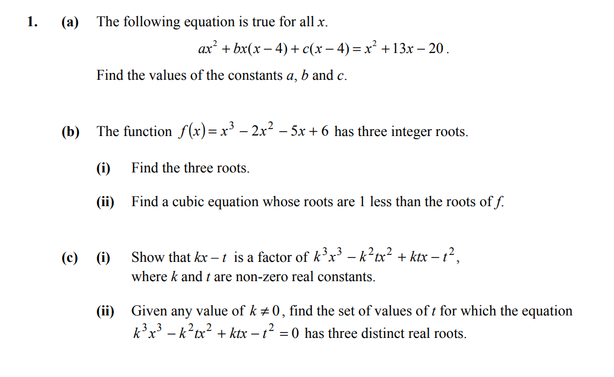
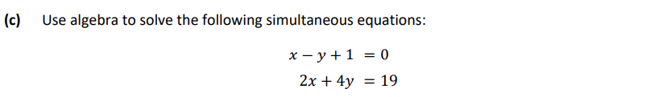
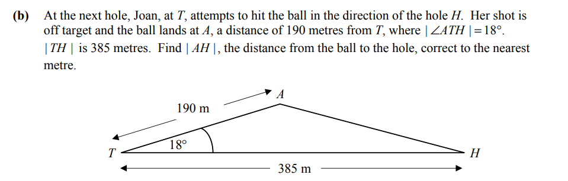

# Hassan's Mock Examination- 17th July, 2023

Instruction for the examination.
You need to attempt 6 out of 7 questions. Every question carries 25 marks.
Answer would be partially marked based on the LC marking scheme.
Try not to use internet or any source to solve the question otherwise it would be difficult for me to interpret your understanding.
Use pen and paper to solve the examination. Once done, please email me the answers to talkabhishekpandey@gmail.com

**Total time for the examination: 2 hours**

**Start Time: 3pm**

**End Time: 5pm**

All the best Hassan.

## **Exam Questions**

### **Question 1 (25 marks)**

### **Question 2 (25 marks)**

### **Question 3 (25 marks)**

### **Question 4 (25 marks)**

### **Question 5 (25 marks)**

### **Question 6 (25 marks)**

### **Question 7 (25 marks)**

## Thank You
